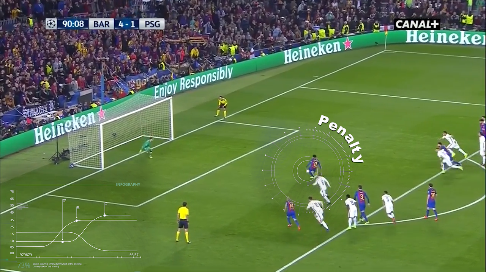

# Preface

This repo contains code to finetune backbone models on the Soccernet dataset. The Soccernet features are used in down-stream tasks, in particular event spotting and replay grounding. In 2021 and 2022, the winning solutions for the Soccernet Challenge localization track used finetuned features generated this way. In the next section, links to the previous best features are attached. This repo is made public so that further progress on feature pretraining can be made or inference could be done on data other than Soccernet (If you do either of these things, do not forget to give a reference to this work). Once better features are generated, this repo will be updated.

## Best Pretrained Soccernet Features from 2021

This other [repo](https://github.com/baidu-research/vidpress-sports) contains the pretrained Soccernet features winning the CVPR 2021 ActivityNet Challange, Temporal Localization track, SoccerNet Challenge for 2021 and 2022. The features were extracted from an ensemble of 5 models. Those are the best features known for Soccernet so far. 

# Train your own model

## Generate low resolution clips

In this section, we will be extracting short 10 seconds clips from the Soccernet videos and the clips will have a lower resolution for training.

Download raw HQ video data from the [Soccernet official website](https://www.soccer-net.org/download). Put it in a folder and set $RAW_VIDEOS_ROOT to that folder.

Run the following command. The output is commands to extract the clips. Redirect the output into a file because there are many extraction commands and you will need to split the file to run the commands in parallel. Choose a folder and set the environment variable $CLIPS_FOLDER to save your clips.

    python data/soccernet/generate_training_short_clips.py --input_folder $RAW_VIDEOS_ROOT --clips_folder=$CLIPS_FOLDER > data/soccernet/generate_training_short_clips.sh

Make a folder to save the paralle scripts:

    mkdir data/soccernet/short_clips_parallel

This is a sample to split into 400 equal parts:

    for i in {0..399};
    do
        sed -n ${i}~400p data/soccernet/generate_training_short_clips.sh > data/soccernet/short_clips_parallel/${i}.sh;
    done

The commands may get stuck on a few videos and render the jobs stuck, so here is another split into 401 parts to run after the above job.

    for i in {0..400};
    do
        sed -n ${i}~401p data/soccernet/generate_training_short_clips.sh > data/soccernet/short_clips_parallel_401/${i}.sh;
    done

## Generate label files

Set $RAW_VIDEOS_ROOT to the root of the folder where all HQ Soccernet videos are downloaded into. Set $LABELS_ROOT to the folder where the labels are.

    python data/soccernet/generate_labels.py \
    --extension mkv \
    --raw_videos_root $RAW_VIDEOS_ROOT \
    --labels_root $LABELS_ROOT \
    --clips_folder $CLIPS_FOLDER

## Run the jobs

Sample code to run them on a slurm based cluster:

    for i in {0..399};
    do
    sbatch -p 1080Ti,2080Ti,TitanXx8  --gres=gpu:1 --cpus-per-task 4 -n 1 --wrap \
    "echo no | bash data/soccernet/short_clips_parallel/${i}.sh" \
    --output="data/soccernet/short_clips_parallel/${i}.log"
    done

For the seconds split,

    for i in {0..400};
    do
    sbatch -p 1080Ti,2080Ti,TitanXx8  --gres=gpu:1 --cpus-per-task 4 -n 1 --wrap \
    "echo no | bash data/soccernet/short_clips_parallel_401/${i}.sh" \
    --output="data/soccernet/short_clips_parallel_401/${i}.log"
    done

# Prepare training with class and event time labels

Generate label_mapping.txt (for category to category index map) and dense.list files.

    python data/soccernet_dense_anchors/generate_dense_anchors_labels.py \
    --clips_folder /mnt/storage/gait-0/xin/dataset/soccernet_456x256 \
    --output_folder ./

Split into train, val, test

    python data/soccernet/split_annotation_into_train_val_test.py \
    --annotation_file dense.list \
    --clips_folder ./ \
    --mode json

Then you will have train.list, val.list, test.list in this folder.

## Training command

    python -u -B -m paddle.distributed.launch --gpus="0,1,2,3,4,5,6,7" --log_dir=logs/soccernet_pptimesformer_k400_videos_dense main.py --validate -c data/soccernet/experiments/pptimesformer/soccernet_pptimesformer_k400_videos_dense.yaml -w pretrained_weights/ppTimeSformer_k400_16f_distill.pdparams

## Training slurm command

    sbatch -p V100x8_mlong --gres=gpu:8 --cpus-per-task 40 -n 1  \
    --wrap "python -u -B -m paddle.distributed.launch --gpus="0,1,2,3,4,5,6,7" --log_dir=logs/soccernet_pptimesformer_k400_videos_dense main.py --validate -c data/soccernet/experiments/pptimesformer/soccernet_pptimesformer_k400_videos_dense.yaml -w pretrained_weights/ppTimeSformer_k400_16f_distill.pdparams" \
    --output="/mnt/storage/gait-0/xin//logs/soccernet_pptimesformer_k400_videos_dense.log"

## Training log link

    TODO

# Inference on whole video files

## Convert video input into lower resolution

This generates a sample script that converts all of the Soccernet videos.

    python data/soccernet_inference/convert_video_to_lower_resolution_for_inference.py \
    --input_folder /mnt/big/multimodal_sports/SoccerNet_HQ/raw_data \
    --output_folder /mnt/storage/gait-0/xin/dataset/soccernet_456x256_inference > \
    data/soccernet_inference/convert_video_to_lower_resolution_for_inference.sh

## Converting video input into 5fps

In order to run inference on half game videos, besides lower resolution to 456x256, the videos had to be run on a lower fps. (The inference sampler decodes the whole video. Then it extracts clips of time intervals [0,n), [1,n+1) etc.

## Parallelize resolution conversion

Each 45 min video files takes about 10 min to convert to lower resolution. So we parallelize to 100 such jobs.

    for i in {0..99};
    do
    sed -n ${i}~100p data/soccernet_inference/convert_video_to_lower_resolution_for_inference.sh > data/soccernet_inference/convert_video_to_lower_resolution_for_inference_parallel/${i}.sh;
    done

Run the parallel jobs on a cluster, slurm based for example.

    for i in {0..99};
    do
    sbatch -p 1080Ti,2080Ti,TitanXx8  --gres=gpu:1 --cpus-per-task 4 -n 1 --wrap \
    "echo no | bash data/soccernet_inference/convert_video_to_lower_resolution_for_inference_parallel/${i}.sh" \
    --output="data/soccernet_inference/convert_video_to_lower_resolution_for_inference_parallel/${i}.log"
    done

## Generate json videos list for inference to read

    python data/soccernet_dense_anchors/generate_whole_video_inference_jsons.py \
    --videos_folder /mnt/storage/gait-0/xin/dataset/soccernet_456x256_inference \
    --output_folder /mnt/storage/gait-0/xin/dataset/soccernet_456x256_inference_json_lists

## Sample inference command

    INFERENCE_WEIGHT_FILE=output/ppTimeSformer_dense_event_lr_100/ppTimeSformer_dense_event_lr_100_epoch_00007.pdparams
    INFERENCE_JSON_CONFIG=/mnt/storage/gait-0/xin/dataset/soccernet_456x256_inference_json_lists/spain_laliga.2016-2017.2017-05-21_-_21-00_Malaga_0_-_2_Real_Madrid.2_LQ.mkv
    INFERENCE_DIR_ROOT=/mnt/storage/gait-0/xin/soccernet_features
    SHORTNAME=`basename "$INFERENCE_JSON_CONFIG" .mkv`
    INFERENCE_DIR=$INFERENCE_DIR_ROOT/$SHORTNAME
    echo $INFERENCE_DIR

    mkdir $INFERENCE_DIR

    python3.7 -B -m paddle.distributed.launch --gpus="0" --log_dir=log_videoswin_test  main.py  --test -c data/soccernet_inference/soccernet_pptimesformer_k400_videos_dense_event_lr_50_one_file_inference.yaml -w $INFERENCE_WEIGHT_FILE -o inference_dir=$INFERENCE_DIR -o DATASET.test.file_path=$INFERENCE_JSON_CONFIG 

## Run all inference 5fps

Needed to sample down to 5fps because of our scale to run all Soccernet data

CONFIG_DIR=/mnt/storage/gait-0/xin/dataset/soccernet_456x256_inference_json_lists_5fps/
INFERENCE_WEIGHT_FILE=output/ppTimeSformer_dense_event_lr_100/ppTimeSformer_dense_event_lr_100_epoch_00028.pdparams
INFERENCE_DIR_ROOT=/mnt/storage/gait-0/xin/soccernet_features

for FILE in /mnt/storage/gait-0/xin/dataset/soccernet_456x256_inference_json_lists_5fps/*;
do 
INFERENCE_JSON_CONFIG=$CONFIG_DIR/$line.mkv
INFERENCE_DIR=$INFERENCE_DIR_ROOT/$line

echo "sbatch -p 1080Ti --gres=gpu:1 --cpus-per-task 4 -n 1  \
--wrap \"python3.7 -B -m paddle.distributed.launch --gpus='0' --log_dir=/mnt/storage/gait-0/xin//logs/$line  main.py  --test -c data/soccernet_inference/soccernet_pptimesformer_k400_videos_dense_event_lr_50_one_file_inference.yaml -w $INFERENCE_WEIGHT_FILE -o inference_dir=$INFERENCE_DIR -o DATASET.test.file_path=$INFERENCE_JSON_CONFIG\" \
--output=\"/mnt/storage/gait-0/xin//logs/$line.log\" "
done

## Check inference logs

These command help you check the last lines of the jobs and see if any bug arose.

CONFIG_DIR=/mnt/storage/gait-0/xin/dataset/soccernet_456x256_inference_json_lists_5fps/
INFERENCE_WEIGHT_FILE=output/ppTimeSformer_dense_event_lr_100/ppTimeSformer_dense_event_lr_100_epoch_00028.pdparams
INFERENCE_DIR_ROOT=/mnt/storage/gait-0/xin/soccernet_features

for FILE in /mnt/storage/gait-0/xin/dataset/soccernet_456x256_inference_json_lists_5fps/*; 
do 
line=`basename "$FILE" .mkv`
INFERENCE_JSON_CONFIG=$CONFIG_DIR/$line.mkv
INFERENCE_DIR=$INFERENCE_DIR_ROOT/$line

log_file=/mnt/storage/gait-0/xin//logs/$line.log
echo $log_file
tail -n 1 /mnt/storage/gait-0/xin//logs/$line.log
tail -n 1 /mnt/storage/gait-0/xin//logs/$line/workerlog.0
done

## Find unfinished jobs
python data/soccernet_dense_anchors/check_unfinished_inference.py \
--inference_root /mnt/storage/gait-0/xin/soccernet_features > inference_matches_todo.txt

## Rerun unfinished jobs 5fps

CONFIG_DIR=/mnt/storage/gait-0/xin/dataset/soccernet_456x256_inference_json_lists_5fps/
INFERENCE_WEIGHT_FILE=output/ppTimeSformer_dense_event_lr_100/ppTimeSformer_dense_event_lr_100_epoch_00028.pdparams
INFERENCE_DIR_ROOT=/mnt/storage/gait-0/xin/soccernet_features

cat inference_matches_todo.txt | while read line 
do 
INFERENCE_JSON_CONFIG=$CONFIG_DIR/$line.mkv
INFERENCE_DIR=$INFERENCE_DIR_ROOT/$line

echo "sbatch -p 1080Ti --gres=gpu:1 --cpus-per-task 4 -n 1  \
--wrap \"python3.7 -B -m paddle.distributed.launch --gpus='0' --log_dir=/mnt/storage/gait-0/xin//logs/$line  main.py  --test -c data/soccernet_inference/soccernet_pptimesformer_k400_videos_dense_event_lr_50_one_file_inference.yaml -w $INFERENCE_WEIGHT_FILE -o inference_dir=$INFERENCE_DIR -o DATASET.test.file_path=$INFERENCE_JSON_CONFIG\" \
--output=\"/mnt/storage/gait-0/xin//logs/$line.log\" "
done > unfinished_inference.sh

# Rerun unfinished full fps

CONFIG_DIR=/mnt/storage/gait-0/xin/dataset/soccernet_456x256_inference_json_lists/
INFERENCE_WEIGHT_FILE=output/ppTimeSformer_dense_event_lr_100/ppTimeSformer_dense_event_lr_100_epoch_00028.pdparams
INFERENCE_DIR_ROOT=/mnt/storage/gait-0/xin/soccernet_features

cat inference_matches_todo.txt | while read line 
do 
INFERENCE_JSON_CONFIG=$CONFIG_DIR/$line.mkv
INFERENCE_DIR=$INFERENCE_DIR_ROOT/$line

echo "sbatch -p 1080Ti,2080Ti,TitanXx8 --gres=gpu:1 --cpus-per-task 4 -n 1  \
--wrap \"python3.7 -B -m paddle.distributed.launch --gpus='0' --log_dir=/mnt/storage/gait-0/xin//logs/$line  main.py  --test -c data/soccernet_inference/soccernet_pptimesformer_k400_videos_dense_event_lr_50_one_file_inference.yaml -w $INFERENCE_WEIGHT_FILE -o inference_dir=$INFERENCE_DIR -o DATASET.test.file_path=$INFERENCE_JSON_CONFIG\" \
--output=\"/mnt/storage/gait-0/xin//logs/$line.log\" "
done

## Inspect logs
Errors:

    /mnt/storage/gait-0/xin//logs/spain_laliga.2015-2016.2015-09-12_-_17-00_Espanyol_0_-_6_Real_Madrid.1_LQ.log

Runtime:

    /mnt/storage/gait-0/xin//logs/spain_laliga.2015-2016.2015-09-12_-_17-00_Espanyol_0_-_6_Real_Madrid.1_LQ/workerlog.0